# Asyncrum Backend API Server 

## 목차

- [1. 프로젝트 개요](#1-프로젝트-개요)
  - [1-1. 프로젝트 소개](#1-1-프로젝트-소개)
  - [1-2. 시스템 구성도](#1-2-시스템-구성도)
  - [1-3. 주요 기능](#1-3-주요-기능)
  - [1-4. 개발 환경](#1-4-개발-환경)
- [2. 개발 결과물](#2-개발-결과물)
  - [2-1. 백엔드 아키텍처](#2-1-백엔드-아키텍처)
  - [2-2. AWS 아키텍처](#2-2-aws-아키텍처)
  - [2-3. API 서버 개발 및 API 문서화/테스트](#2-3-api-서버-개발-및-api-문서화테스트)
  - [2-4. API 서버 단위 테스트 및 테스트 커버리지](#2-4-api-서버-단위-테스트-및-테스트-커버리지)
  - [2-5. API 서버 리팩토링](#2-5-api-서버-리팩토링)
  - [2-6. API 서버 CI/CD 파이프라인](#2-6-api-서버-cicd-파이프라인)
  - [2-7. AWS S3 Presigned URL 기반 미디어 업로드](#2-7-aws-s3-presigned-url-기반-미디어-업로드)
  - [2-8. Jitsi 기반 화상회의 시스템](#2-8-jitsi-기반-화상회의-시스템)
  - [2-9. AWS 기반 API Gateway](#2-9-aws-기반-api-gateway)
- [3. 수행 방법 및 프로젝트 관리](#3-수행-방법-및-프로젝트-관리)
  - [3-1. 개발 프로세스](#3-1-개발-프로세스)
  - [3-2. 형상 관리 프로세스](#3-2-형상-관리-프로세스)
  - [3-3. 리팩토링 문화](#3-3-리팩토링-문화)

## 1. 프로젝트 개요

### 1-1. 프로젝트 소개

동시 편집 화이트보드와 동영상을 결합한 협업 소프트웨어로서 원격으로 근무하는 팀을 돕습니다. 비디오 로그 기능을 통해 시차가 존재하는 팀원간의 커뮤니케이션을 원활하게 합니다.

SW마에스트로 벤처 프로젝트로써 네이버 SmartStudio Alto 팀, Yorkie 팀과 협업하며 개발을 진행했습니다.

### 1-2. 시스템 구성도

### 1-3. 주요 기능

- 팀 워크스페이스(Team Dashboard)
  - 데일리 스크럼 리스트
  - 화이트보드 문서 리스트
  - 화상 회의 리스트
- 데일리 스크럼(Daily Standups)
  - 데일리 스크럼 녹화
  - 데일리 스크럼 시청: 드로밍 및 북마크가 가능한 비디오 플레이어 드로밍 및 북마크가 가능한 비디오 플레이어
- 화이트보드 문서
  - 이미지/동영상을 업로드 할 수 있는 화이트보드
  - 동시편집 화이트보드
- 화상 회의
  - 미팅 초대, 실시간 채팅, 리액션 등 완전한 화상 회의가 가능한 화상 회의

### 1-4. 개발 환경

- Front-end: JavaScript, TypeScript, React.js, Redux, SCSS, Yorkie
- Back-end: Java, Spring Boot, JPA, Mysql, MongoDB, AWS, K8S, Docker, WebRTC, Jitsi, gRPC

## 2. 개발 결과물

### 2-1. 백엔드 아키텍처

**Reference**: [백엔드 아키텍처 Ver.0 to Ver.3](https://bit.ly/3DQ6Fac)

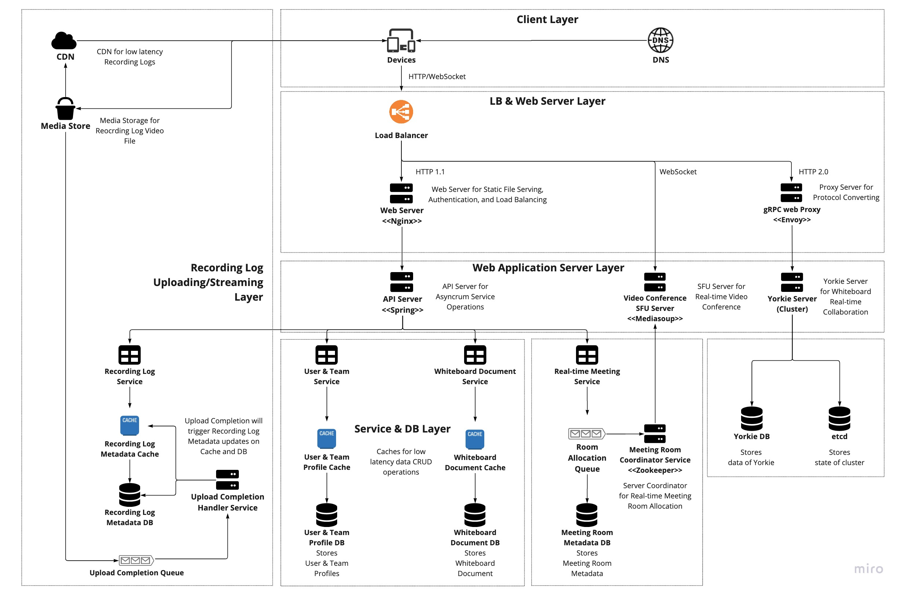

시스템 구성도를 기반으로 백엔드 아키텍처를 설계하였으며, 버전 0.1에서 버전 3.0까지 백엔드 아키텍처를 발전시켰습니다.

백엔드 아키텍처는 Access Layer, Sync/Async Layer, Persist Layer 등의 백엔드 아키텍처의 기본적인 구조 정립, 프로토콜별 시스템의 흐름 분기 표현, 미팅룸 서버를 위한 Apache Zookeeper, 미디어 처리를 위한 Kafka 메시지 큐 등 서비스 도메인에서 쓰이는 구체적인 컴포넌트들의 배치, 웹 레이어, 서비스/DB 레이어, 미디어 레이어 등의 웹 호스팅 아키텍처로의 재정립 등의 과정을 거치며 발전하였습니다.

### 2-2. AWS 아키텍처

**Reference**: [AWS 기반 Asyncrum 웹 호스팅 아키텍처 Ver.1 to Ver.6](https://bit.ly/3TVBNKS)

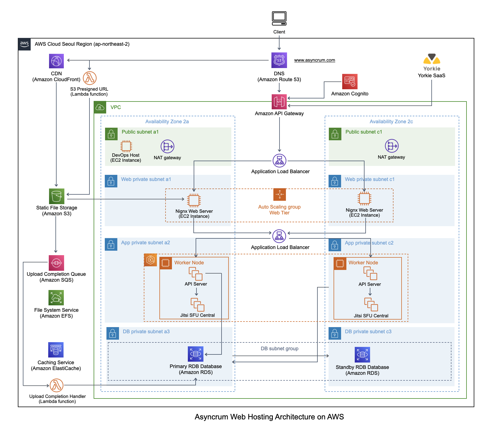

백엔드 아키텍처 버전 3.0을 기반으로 AWS 기반의 클라우드 아키텍처를 설계하였으며, 시스템을 개발하면서 AWS 아키텍처 또한 버전 1.0에서 6.0까지 지속해서 발전시켰습니다.

AWS 기반 Asyncrum 웹 호스팅 아키텍처는 VPC를 통한 레이어링과 Multi-AZ를 통한 이중화, S3 Presigned URL 도입 및 Lambda 함수 도입을 통한 미디어 업로드/다운로드 시스템 구축, API Gateway 및 Congnito 도입을 통한 Access Layer 구축, K8s 기반 EKS 도입을 통한 앱 레이어 서버들의 컨테이너화 및 컨테이너 관리 시스템 구축 등의 과정을 거치며 발전하였습니다.

### 2-3. API 서버 개발 및 API 문서화/테스트

백엔드 API 서버 개발은 Java와 Spring 기반으로 진행하였으며, OpenAPI Spec에 맞는 RESTful한 API를 개발하였습니다. API 서버 개발은 Swagger와 Postman을 통해 문서화 및 테스트를 진행하였습니다.

**Swagger**

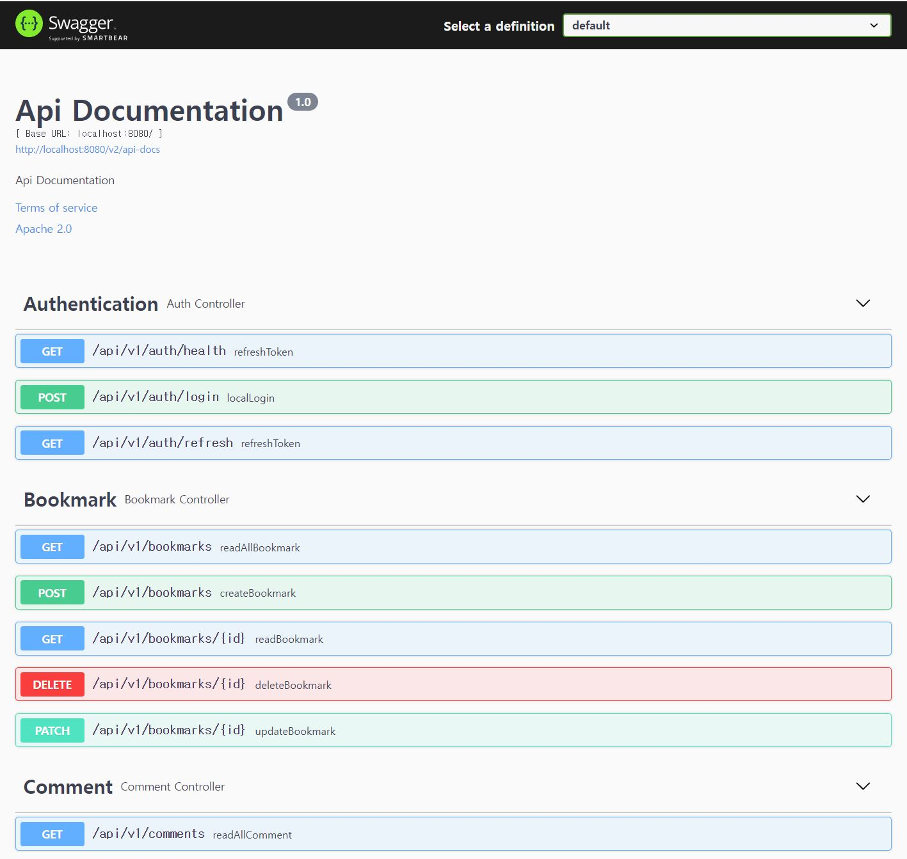

OpenAPI 3.0 Spec을 준수하는 Swagger를 사용하여 API 문서화를 진행하였습니다.

또한 해당 Swagger API Documentation을 통해 AWS API Gateway의 API를 구성하였습니다.

**Postman**

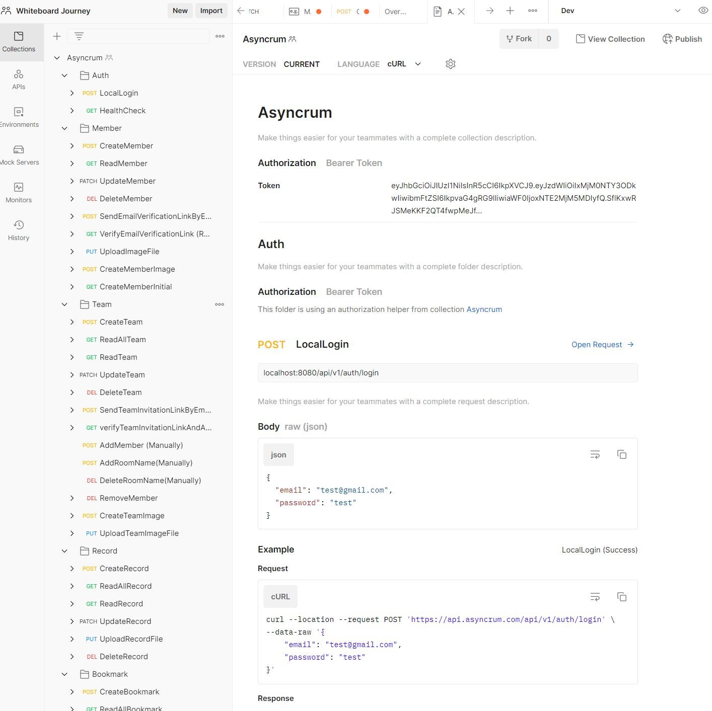

API Platform인 Postman을 이용하여, Development 환경과 Deployment 환경 모두에서 API 테스팅을 할 수 있도록 자동화 구성하였습니다.

또한 Postman의 Mock Server 기능을 이용하여 프론트엔드가 백엔드의 개발을 기다리지 않고 API를 테스트할 수 있도록 구성하였습니다.

### 2-4. API 서버 단위 테스트 및 테스트 커버리지

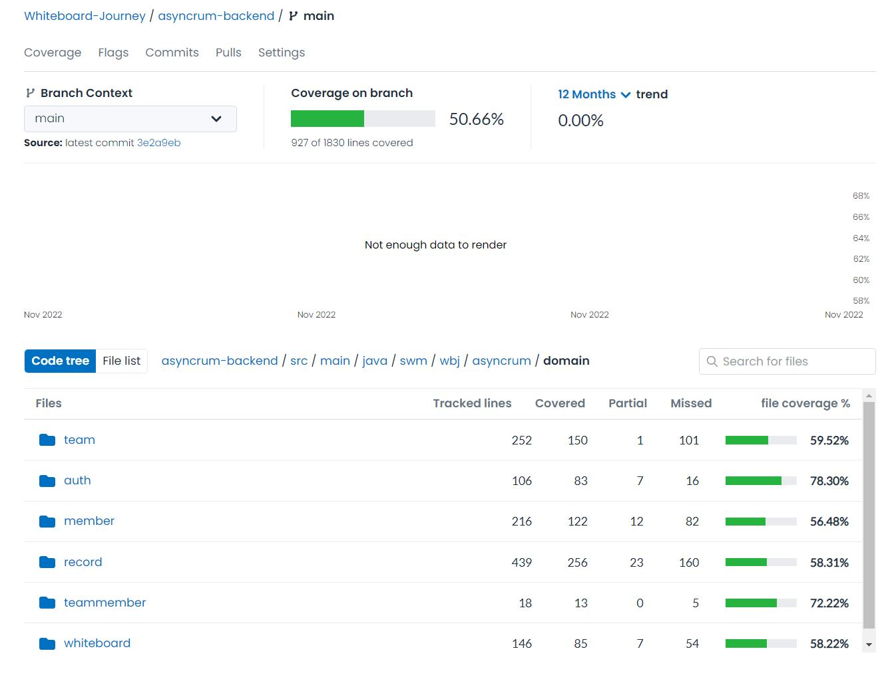

API 서버에 존재하는 모든 도메인의 서비스 레이어에 대한 JUnit/Mockito 기반 단위 테스트를 작성하여 코드 커버리지 51% 수준으로 비즈니스 로직을 검증하였습니다.

또한 해당 테스트 결과를 Codecov를 통해 Code Coverage를 측정 및 트래킹하였습니다.

### 2-5. API 서버 리팩토링

**Reference**: [Asyncrum API 서버 리팩토링 내역 리스트](https://bit.ly/3NwcKf9)

API의 핵심적인 부분을 모두 개발한 후, 리팩토링 주기에 맞춰 지속적으로 코드를 개선하고, 로직을 최적화하였습니다.

OSIV OFF를 통한 DB 커넥션 최적화, JQPL FETCH JOIN 및 Batch를 통한 Query 최적화, AOP를 통한 RBAC 권한 로직 분리 및 예외처리 로직 분리 등 다양한 레이어에서 최적화 및 코드 개선을 이루었습니다.

### 2-6. API 서버 CI/CD 파이프라인

**Reference**: [Jenkins/ArgoCD를 통한 API Server CI/CD (지속적 통합/지속적 배포) Ver 1. to Ver.2](https://bit.ly/3WfwEPH)

애자일한 API 서버 작업 및 배포를 보장하기 위해, Jenkins를 통한 CI/CD pipeline을 구축하였으며, 이후 AWS EKS(K8s)의 도입에 따라 pipeline을 Jenkins + ArgoCD으로 개선하였습니다. 이를 통해 지속적으로 변경되는 API 서버의 패키징/K8s 배포 과정을 자동화하였습니다.

**API Server CI/CD WorkFlow Ver 2.0**

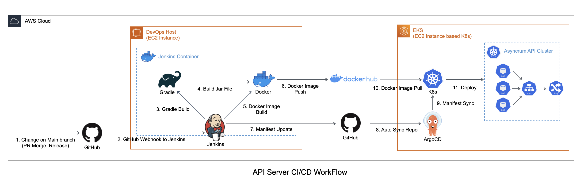

**Jenkins Pipeline Build History**

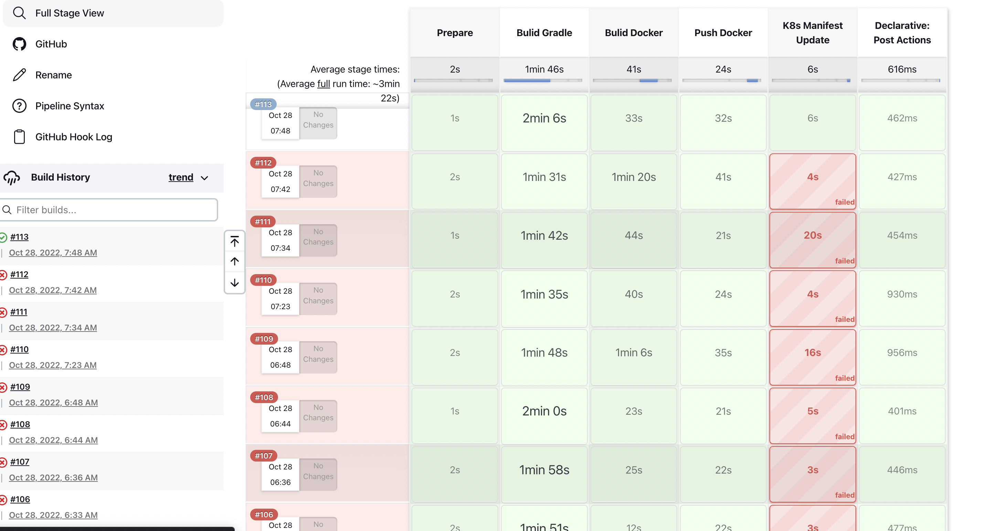

**ArgoCD Application Detail Tree**

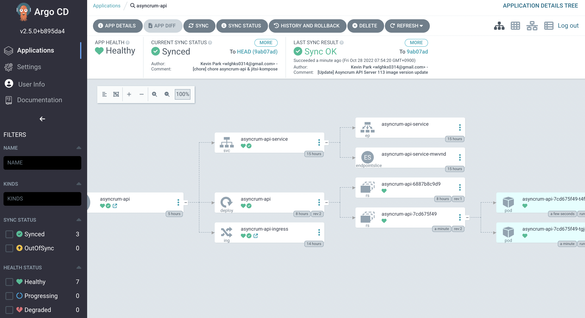

### 2-7. AWS S3 Presigned URL 기반 미디어 업로드

**Reference**: [AWS S3 Presigned URL 기반 파일 업로드 및 스트리밍](https://bit.ly/3zFQV7o)

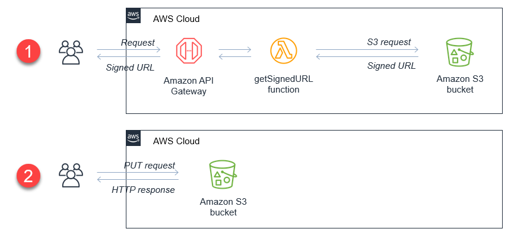

콘텐츠 중심의 서비스라는 (비디오, 화이트보드 문서) 특성을 고려하여 업계 최고 수준의 확장성과 안정성을 보장하는 객체 저장소 서비스인 AWS S3를 이용하였으며, 미디어 처리 로직을 Lambda 함수 등에게 위임하여, API 서버는 용량이 큰 미디어 파일들을 처리하지 않도록 구성하였습니다.

별도의 인증과정 없이 파일을 업로드 또는 다운로드하는 것을 막기 위해, AWS S3에서 제공하는 Presigned URL를 통해 파일 업로드/다운로드의 안전성을 확보하였습니다.

### 2-8. Jitsi 기반 화상회의 시스템

화상 회의에서는 화상 화면 바디오이나 오디오 등 여러 미디어 스트림을 회의 참여자들이 주고 받아야하기 떄문에, WebRTC의 SFU Topology를 구현하는 Java 기반의 WebRTC 오픈소스인 Jitsi를 사용하였습니다.

또한 Jitsi Docker와 Kubernetes/Helm 등을 사용하여 K8s 형상으로 Jitsi Central을 AWS EKS 위에 구축하였습니다.

### 2-9. AWS 기반 API Gateway

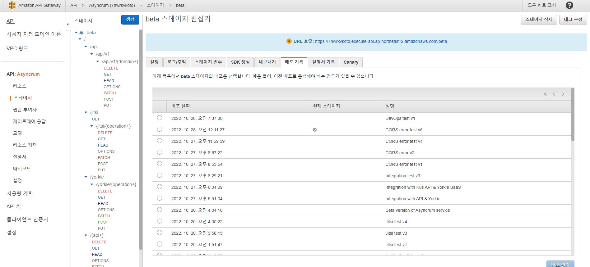

여러 서비스들이 존재하는 백엔드의 API들을 하나 묶어 제공하기 위해 Facade Pattern을 구현하고, 백엔드 서비스의 정문 역할을 하는 AWS API Gateway를 사용하였습니다.

이를 통해 메세지 라우팅, 로깅, 모니터링, HTTPS Termination, JWT 기반 AuthN/AuthZ 등을 한 곳에서 수행할 수 있었습니다.

동시 편집을 위한 서비스인 Yorkie SaaS 또한 API Gateway의 external service로 묶어 제공하였습니다.

## 3. 수행 방법 및 프로젝트 관리

### 3-1. 개발 프로세스

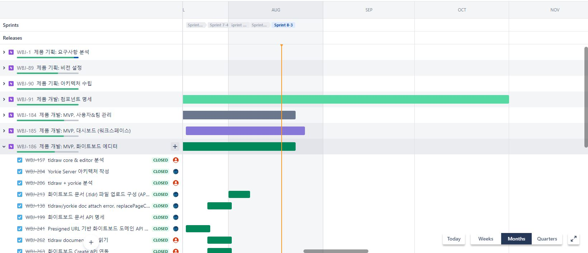

빠른 MVP를 목표로 하여 짧은 개발 사이클을 가져가기 위해 전체 개발 프로세스에는 스크럼 방식을 채택하였습니다.

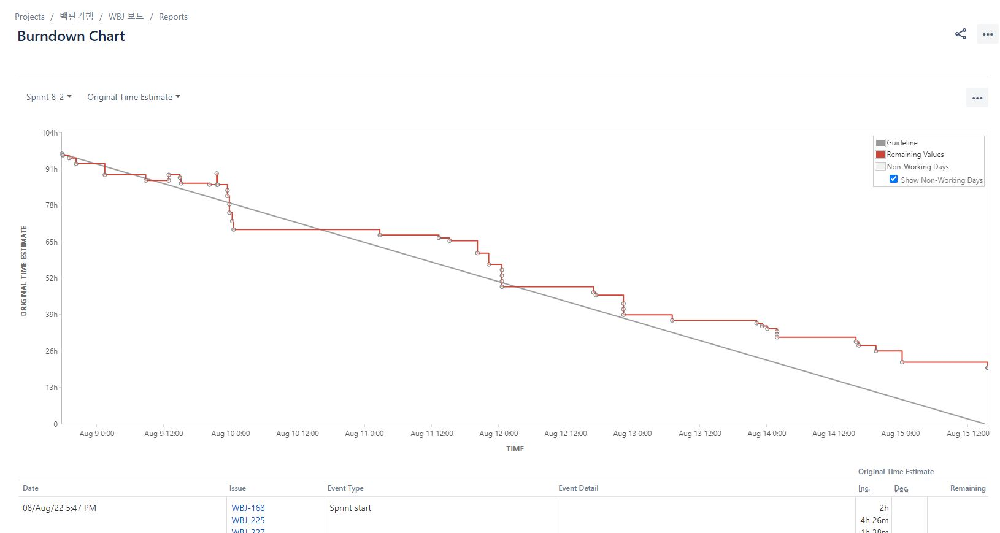

번다운 차트 등의 메트릭을 볼 수 있고, 이슈 세부 컨트롤이 가능한 Jira를 통해 이슈 관리를 진행하였으며, 가볍고 공유하기 쉬운 Notion과, 팀 내부 문서 관리 및 Jira와의 Integration을 위해 Confluence 2개의 툴을 사용하여 문서화를 수행하였습니다.

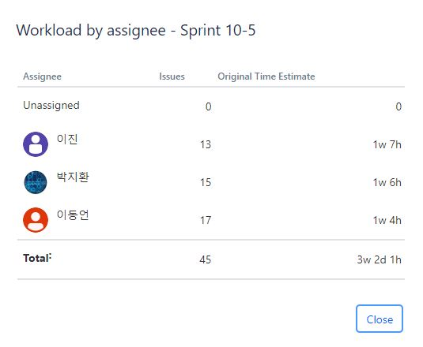

실제 프로젝트 개발 기간이 4개월로 짧다는 점과, 팀원들이 스크럼 경험이 없었던 점을 고려하여, 1주 단위의 스프린트를 통해 개발을 진행하였으며, 측정이 어려운 Story Point 대신 Original Time Estimate를 기준으로 스프린트 계획을 세운 후, 스프린트를 진행하였습니다.

스프린트가 끝난 후, 팀 자체적으로 4Ls 형식의 스프린트 회고를 진행한 후, Action Item 설정을 통해 이후 스프린트에 반영할 수 있도록 계획하였습니다. 이를 통해 초기에 설정한 Original Time Estimate을 계속해서 최적화 해나갔고, 이후 Engineer당 30hr이라는 팀에게 맞는 최적의 Original Time Estimate를 설정할 수 있었습니다.

### 3-2. 형상 관리 프로세스

**Reference**: [형상 관리를 위한 Git-Flow 및 GitHub 템플릿 도입](https://bit.ly/3fmGTRo)

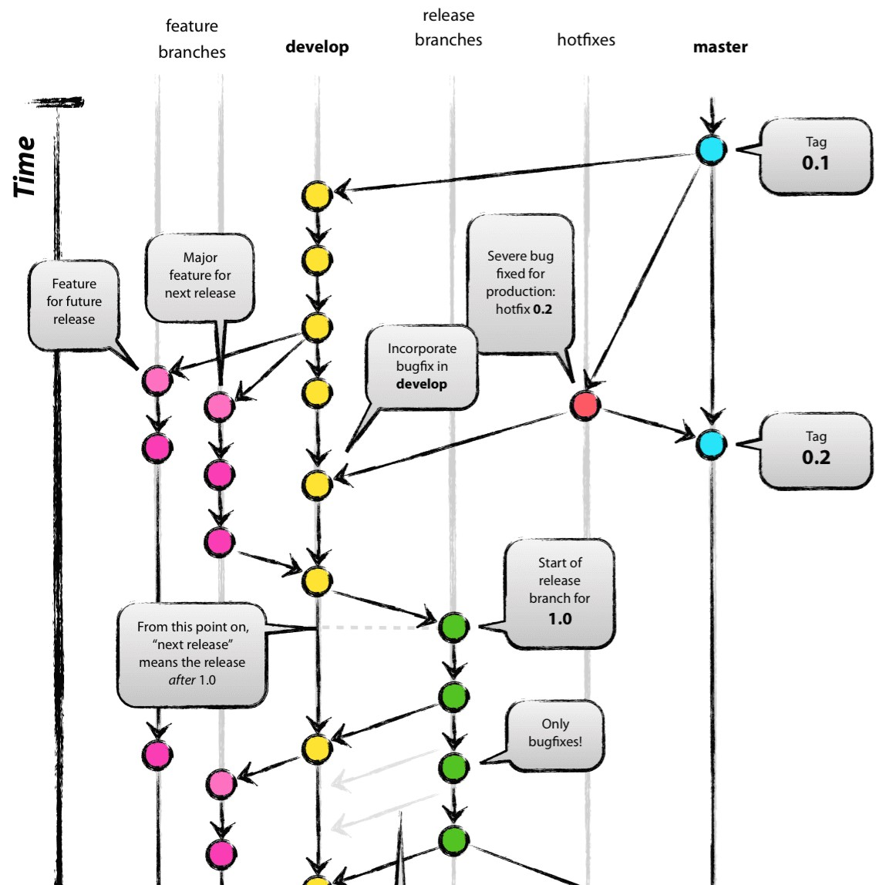

프로젝트의 형상 관리를 위해 Git, GitHub를 사용하였으며, 일관된 개발 프로세스를 팀 내에서 유지하기 위해 Git-Flow 모델을 도입하였습니다. 이를 통해 PR 기반으로 feature → develop → main의 개발 프로세스를 수립하였습니다.

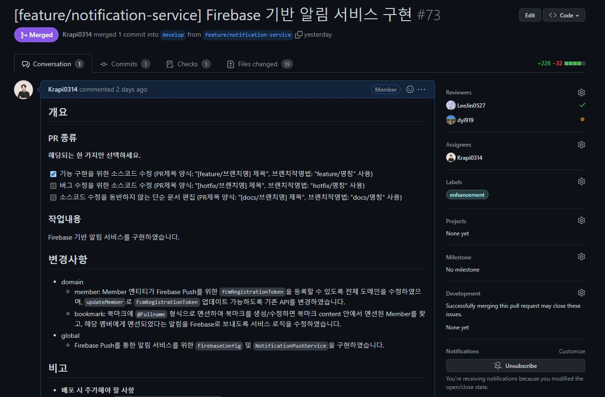

또한 PR, Issue 등은 템플릿화하여, 팀원들이 모두 같은 형식으로 PR과 Issue들을 작성할 수 있게 하여, 개발 문서의 일관성을 유지하였습니다.

### 3-3. 리팩토링 문화

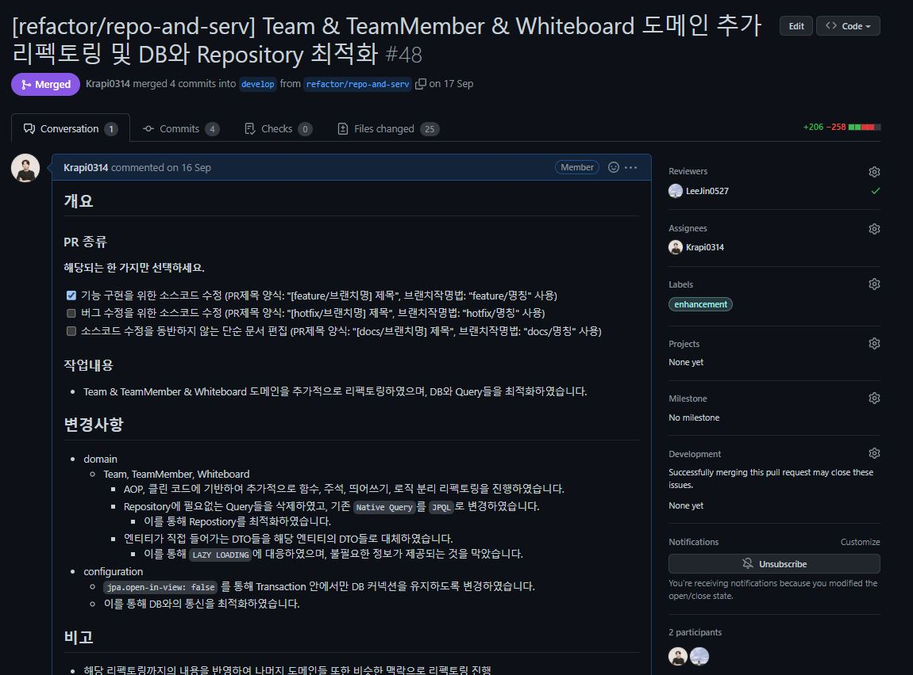

개발을 진행하면서 쌓인 기술 부채를 해결하기 위해 그동안 팀원들과 공부한 클린 코드와 각종 강의/서적들을 기반으로 리팩토링을 진행할 수 있도록 1주 간의 리팩토링 기간을 설정하여 리팩토링을 진행하였습니다.

이 1주일 간의 리펙토링 기간을 통해, 백엔드에서는 AOP를 통한 객체지향적인 구조의 달성, 쿼리 최적화를 통한 DB 통신 비용의 감소 등의 향상을 이끌어낼 수 있었습니다.

이 과정을 통해 팀원들 스스로가 예전에 비해 얼마나 성장했는지 알 수 있게 된 좋은 계기가 되었습니다.
